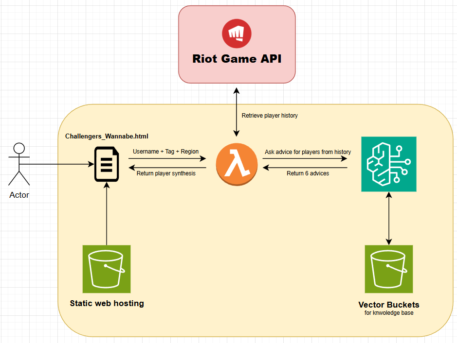

# challengers_wannabe

The goal of this project is to deploy an AWS stack that allows League of Legends players to identify areas for improvement by comparing their gameplay with EUW Challengers data. The project also leverages AI services like AWS Bedrock to provide specialized advice based on players’ playstyles.

The project is divided into two main parts:

- **Data Retrieval and Analysis**
  - Download the EUW top players’ match history for the 2025 season.
  - Perform data exploration and analysis to extract challenger behaviors.
- **Web Interface**
  - Homepage for user interaction.
  - Backend code to retrieve a player’s match history, transform the data, and use Bedrock services to generate actionable advice.

---

# How to Use

### Download the Project

```bash
git clone https://github.com/HungryHunt/challengers_wannabe.git
cd ./challengers_wannabe
```

### For local development : 
  - Python environment
    - installing requirements libraries
      - ````pip install -r ./Web/Back_end/requirements.txt ````
  - AWS CLI configured

# AWS Architecture



- **S3**
  - **Website Bucket:** Contains only files (HTML, PNG) necessary for the user experience.
  - **Vector Buckets:** Serve as a vector store for the Bedrock knowledge base.
- **Lambda**
  - Acts as the backend.
- **Bedrock**
  - **Knowledge Base:**  
    - Data extracted from the data exploration phase.
    - Improvement areas for each division to help players progress.
    - General gameplay advice.
  - **Models:**  
    - Nova Lite 1.0

The main goal of this architecture is to provide the best user experience at minimal cost. The solution is designed to be cost-efficient.  

Using S3 + Lambda for the web layer avoids managing a web server and eliminates scalability concerns. This serverless approach ensures full scalability with low-cost services.  

The data used by AWS Lambda to compare with players’ data is stored as CSV files within the code package. Since the data is only used as a reference and is relatively small, using an RDS database would be unnecessary.  

Using AWS S3 Vector Buckets as a vector store removes the need to run an OpenSearch serverless process continuously, which would be inefficient given the infrequent updates to the knowledge base.  

Nova Lite was chosen because it is cost-effective. More importantly, since most LLMs are not directly trained on League of Legends data, their advice on areas of improvement is often generic. By combining a rich knowledge base with the right model settings, Nova Lite delivers more accurate and specialized advice based on players’ match histories.

---

# Data Exploration

Data is at the core of this project.  

We gathered as much information as possible from top players (despite low API rate limits) and processed it to extract insights from the best performers.  

Since League of Legends is highly complex, comparing challenger data by role alone, without considering champion specificity, would be misleading (e.g., comparing Assassin and Tank performance as if they were the same). This is why we also collected games from the best OTPs (One-Trick Ponies—players who consistently play the same champion) to obtain champion-specific stats.  

Data exploration was performed using Apache PySpark locally. This approach ensures that if the dataset grows, we can still leverage Spark with services like EMR Serverless.  

At the end of the data exploration phase, all knowledge was condensed into CSV files. The files are small, and even with increased data volume, the output size would remain manageable.  

Future steps could include repeating these analyses for all divisions, which would provide even more precise insights into potential areas for improvement. However, API rate limits currently prevent this. Expanding the dataset would further strengthen the Bedrock knowledge base and specialized agents.